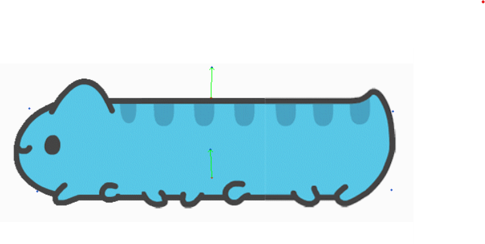
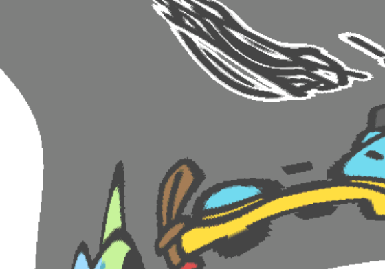

# Assignment 1 
# Image Warping 实验报告

### SA22001045 施羽翔

### Resources:
- [Teaching Slides](https://rec.ustc.edu.cn/share/afbf05a0-710c-11ef-80c6-518b4c8c0b96) 
- [Paper: Image Deformation Using Moving Least Squares](https://people.engr.tamu.edu/schaefer/research/mls.pdf)
- [Paper: Image Warping by Radial Basis Functions](https://www.sci.utah.edu/~gerig/CS6640-F2010/Project3/Arad-1995.pdf)
- [OpenCV Geometric Transformations](https://docs.opencv.org/4.x/da/d6e/tutorial_py_geometric_transformations.html)
- [Gradio: 一个好用的网页端交互GUI](https://www.gradio.app/)

### 1. Basic Image Geometric Transformation (Scale/Rotation/Translation).
Fill the [Missing Part](run_global_transform.py#L21) of 'run_global_transform.py'.


### 2. Point Based Image Deformation.

Implement MLS based image deformation in the [Missing Part](run_point_transform.py#L52) of 'run_point_transform.py'.

---
## Requirements

To install requirements:

```setup
python -m pip install -r requirements.txt
```


## Running

To run basic transformation, run:

```basic
python run_global_transform.py
```

To run point guided transformation, run:

```point
python run_point_transform.py
```

## Implement
我的实现用了向后映射的方法。假设p为拖拽后控制点的位置，q为原图像中控制点的位置，我们利用移动最小二乘法来为变形后图像上的每个像素点v构建相应的仿射逆变换lv(x)，并通过该变换来计算得到图像变形后的像素点对应于原图的位置。

实现过程的公式参照了[卡通图像变形](https://www.cnblogs.com/shushen/p/5887513.html)。并完成了刚体、相似、仿射三种形式的MLS变形，在GUI界面可以通过单选框切换这三种算法。
## Results
### Basic Transformation


### Point Guided Deformation:

<center>MLS图像变形算法效果</center>
<figure class="half">
    
    
    <center>MLS刚体变形，示例1</center>
</figure>
<figure class="half">
    
    
    <center>MLS刚体变形，示例2</center>
</figure>
<center></center>
<figure class="half">
    
    
    
    <center>原图(上); 刚体变形(左)相似变形(中)仿射变形(右)</center>
</figure>

实验效果上，仿射变形由于会产生非固定比例的缩放，效果较差。相似变换倾向于产生近似与原图片的缩放图。而刚体变换则倾向于不产生过大的局部缩放。

## Acknowledgement

>📋 Thanks for the algorithms proposed by [Image Deformation Using Moving Least Squares](https://people.engr.tamu.edu/schaefer/research/mls.pdf).
